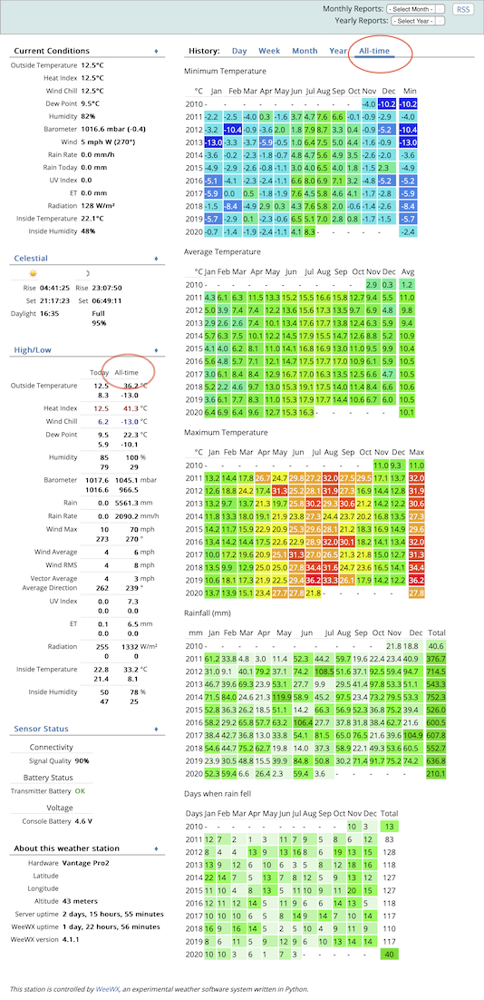
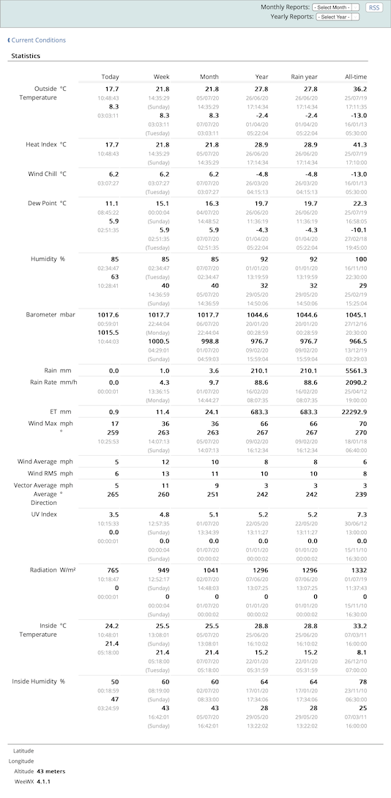

# alltimeSeasons skin

## Summary
These files modify the included weewx skin Seasons to include all-time data. 

## Overview
I wanted to be able to compare the rainfall in May with rainfall last year, well in fact all the years my weather station has been operating. 
I also wanted to able to compare temperature and perhaps wind. Surprisingly the standard weewx installation doesnt include this facility but 
due to its excellent design it's fairly straightforward to add a new skin to do what you want. I really liked the, now standard, Season skin so I used 
that as a starting point. Here are some screen shots of the results.

&nbsp;&nbsp;&nbsp;&nbsp;

## Solution

The grunt of the work was done by brewster76 with his new skin using Bootstrap, indeed you may prefer his solution as it also includes gauges 
and a full installer. Check it out here https://github.com/brewster76/fuzzy-archer

I used his, very slightly modified, python code to generate the actual historic tables and then modified the Seasons template to include the results.

## Installation

This is a manual install.

First make a copy of the Seasons skin including all the sub directories. I called mine alltimeSeasons.

Then replace the files in the new alltimeSeasons with those provided here.

Then copy the historygenerator.py file provided in the user/bin directory to the user bin directory in your weewx installation. Note this is different depending on how you installed weewx. If you installed via DEB/RPM then its /usr/share/weewx/user if you installed using setup.py then its /home/weewx/bin/user.

Finally edit your weewx.conf file and change the skin to your new skin, I just changed the original to point to the new location.

        [[SeasonsReport]]
                # The SeasonsReport uses the 'Seasons' skin, which contains the
                # images, templates and plots for the report.
                skin = alltimeSeasons
                enable = true

In theory that's all. However, although I have done this on my own system I haven't actually followed these instructions on a clean install to confirm they work. If you try you may well be the first. If you find a problem then please let me know and I'll do my best to correct it.

